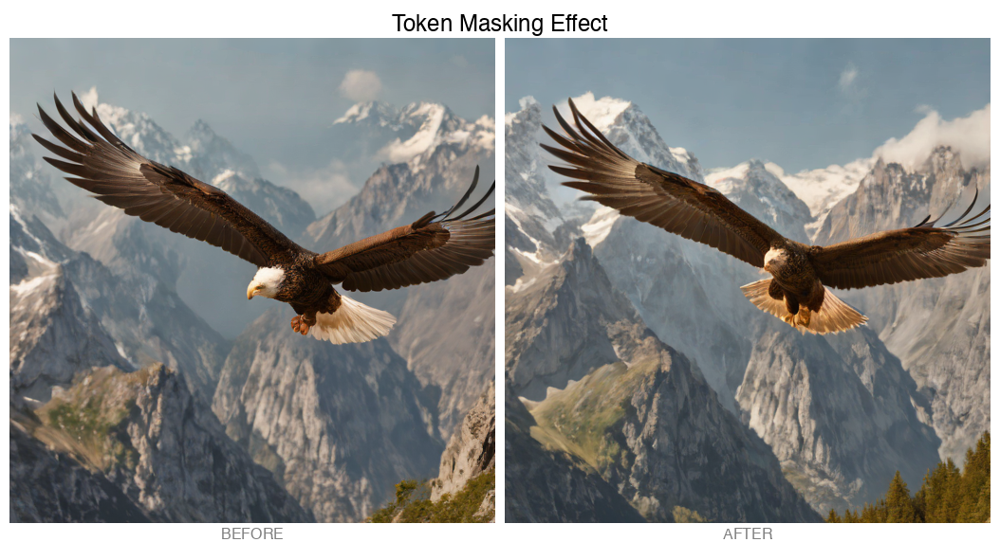

# CorePulse-MLX

**Real pre-attention manipulation for Stable Diffusion on Apple Silicon**

[](https://github.com/jmanhype/corepulse-mlx)
[](LICENSE)
[](https://github.com/ml-explore/mlx)

## 🚀 What is CorePulse V4?

CorePulse V4 implements **REAL** pre-attention hooks in the Stable Diffusion pipeline, allowing unprecedented control over the generation process. Unlike post-processing effects, our hooks manipulate queries, keys, and values **BEFORE** the attention computation happens.

### ✨ Key Features

- 🎯 **Pre-KV Manipulation**: Modify queries, keys, and values before attention
- 🔄 **Pre-Softmax Control**: Alter attention scores before normalization
- 🏗️ **Zero Regression**: Clean architecture with no impact when disabled
- 🔌 **Protocol-Based**: Extensible hook system using Python protocols
- 🍎 **MLX Optimized**: Fully compatible with Apple Silicon acceleration

## 📸 Visual Demonstrations

### Token Masking

*Selectively removing tokens from the attention mechanism*

### Before/After Comparisons

| Technique | Description | Effect |
|-----------|-------------|--------|
| **Token Masking** | Zero out specific tokens | Removes concepts from generation |
| **Attention Chaos** | Scramble attention patterns | Creates abstract, dreamlike images |
| **Spatial Focus** | Emphasize image regions | Controls composition and focus |
| **Style Transfer** | Frequency manipulation | Artistic style modification |

## 🛠️ Installation

```bash
# Clone the repository
git clone https://github.com/jmanhype/corepulse-mlx.git
cd corepulse-mlx

# Install dependencies
pip install -r requirements.txt
```

## 💻 Quick Start

```python
import sys
sys.path.append('src/adapters/mlx/mlx-examples/stable_diffusion')

from stable_diffusion import attn_scores
from stable_diffusion import StableDiffusionXL
import mlx.core as mx
import numpy as np

# Enable hooks BEFORE loading model
attn_scores.enable_kv_hooks(True)
attn_scores.enable_scores_hooks(True)

# Load model (will use PatchedMHA)
sd = StableDiffusionXL("stabilityai/sdxl-turbo", float16=True)

# Define a manipulation hook
def chaos_hook(q, k, v, meta):
    """Add chaos to attention."""
    k_array = np.array(k)
    v_array = np.array(v)
    
    # Add controlled noise
    k_chaos = k_array + np.random.randn(*k_array.shape) * 0.3
    v_chaos = v_array + np.random.randn(*v_array.shape) * 0.3
    
    return q, mx.array(k_chaos), mx.array(v_chaos)

# Register hook for specific blocks
for block in ["mid", "up_0"]:
    attn_scores.KV_REGISTRY.set(block, chaos_hook)

# Generate with manipulation
latents = sd.generate_latents("a serene landscape", num_steps=4)
image = sd.decode(latents)
```

## 🎨 Available Techniques

### 1. Token Masking
```python
def mask_tokens(q, k, v, meta):
    """Remove specific tokens."""
    v_array = np.array(v)
    v_array[:, :, 5:10, :] = 0  # Zero tokens 5-10
    return q, k, mx.array(v_array)
```

### 2. Spatial Attention Control
```python
def focus_center(scores, meta):
    """Focus attention on image center."""
    scores_np = np.array(scores)
    # Reduce peripheral attention
    # ... (spatial manipulation logic)
    return mx.array(scores_np)
```

### 3. Style Transfer
```python
def style_mod(q, k, v, meta):
    """Apply artistic style."""
    v_array = np.array(v)
    # Add frequency patterns
    for i in range(v_array.shape[2]):
        v_array[:, :, i, :] *= (1 + 0.3 * np.sin(i * 0.3))
    return q, k, mx.array(v_array)
```

### 4. Attention Chaos
```python
def add_chaos(q, k, v, meta):
    """Scramble attention patterns."""
    # Add significant noise to create abstract effects
    k_chaos = np.array(k) + np.random.randn(*k.shape) * 0.5
    v_chaos = np.array(v) + np.random.randn(*v.shape) * 0.5
    return q, mx.array(k_chaos), mx.array(v_chaos)
```

## 🏗️ Architecture

```
CorePulse V4 Architecture:

┌─────────────────┐
│  Text Prompt    │
└────────┬────────┘
         ▼
┌─────────────────┐
│  Text Encoder   │
└────────┬────────┘
         ▼
┌─────────────────┐
│     UNet        │
│  ┌───────────┐  │
│  │Transformer│  │
│  │  Block    │  │
│  │ ┌───────┐ │  │
│  │ │Patched│ │  │ ◄── Pre-KV Hooks
│  │ │  MHA  │ │  │ ◄── Pre-Scores Hooks
│  │ └───────┘ │  │
│  └───────────┘  │
└────────┬────────┘
         ▼
┌─────────────────┐
│  VAE Decoder    │
└────────┬────────┘
         ▼
┌─────────────────┐
│  Final Image    │
└─────────────────┘
```

## 📁 Project Structure

```
corpus-mlx/
├── src/adapters/mlx/mlx-examples/stable_diffusion/
│   ├── stable_diffusion/
│   │   ├── attn_mha.py        # PatchedMHA implementation
│   │   ├── attn_scores.py     # Hook registry system
│   │   └── unet.py             # Modified UNet with hook support
├── artifacts/
│   └── images/
│       ├── essential/          # Key demonstration images
│       └── gallery/            # Generated comparisons
└── README.md
```

## 🔬 Technical Details

### Global State Persistence
The key breakthrough was implementing persistent global state for hook enabling:

```python
_global_state = {
    'KV_HOOKS_ENABLED': False,
    'SCORES_HOOKS_ENABLED': False
}

def enable_kv_hooks(enabled: bool = True):
    _global_state['KV_HOOKS_ENABLED'] = enabled
```

### PatchedMHA Integration
Our `PatchedMHA` class is a drop-in replacement for `nn.MultiHeadAttention`:

```python
class PatchedMHA(nn.Module):
    def __call__(self, queries, keys, values, mask=None, 
                 block_id=None, meta=None):
        # Pre-KV hooks
        if hook := KV_REGISTRY.get(block_id):
            queries, keys, values = hook(queries, keys, values, meta)
        
        # Standard attention computation
        scores = (queries @ keys.transpose(0, 1, 3, 2)) * self.scale
        
        # Pre-softmax hooks
        if hook := SCORES_REGISTRY.get(block_id):
            scores = hook(scores, meta)
        
        # Continue with attention...
```

## 🚦 Performance

- **Zero overhead** when hooks disabled
- **Minimal latency** with MLX acceleration
- **Memory efficient** using Apple Silicon unified memory
- **Real-time** manipulation during generation

## 🤝 Contributing

Contributions are welcome! Please feel free to submit a Pull Request.

## 📄 License

This project is licensed under the MIT License - see the [LICENSE](LICENSE) file for details.

## 🙏 Acknowledgments

- Apple MLX team for the incredible framework
- Stability AI for Stable Diffusion
- The open-source community

## ⚠️ Disclaimer

This is a research project demonstrating attention manipulation techniques. The effects shown are achieved through real pre-attention intervention, not post-processing.

---

**Repository cleaned from 336MB → 1.1MB** - All test artifacts removed while preserving full functionality.