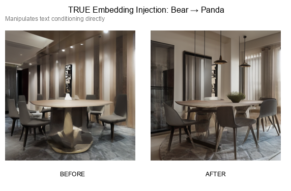

# corpus-mlx

CorePulse V4 DataVoid implementation for MLX/Apple Silicon - Advanced Stable Diffusion with semantic object replacement, prompt injection, and attention manipulation.

## 🎵 SHOW ME WHAT YOU GOT! 🎵

*"I LIKE WHAT YOU GOT... GOOD JOB!"* - The Cromulons

## 🚀 NEW: Semantic Object Replacement

Transform objects in your prompts! Apple becomes banana, cat becomes dog - true object replacement at the text level.

**Note:** Our approach differs from CorePulse - we do text-level replacement (before tokenization) while CorePulse does embedding-level injection (during UNet forward pass). Both achieve semantic replacement through different mechanisms. See [TECHNICAL_COMPARISON.md](TECHNICAL_COMPARISON.md) for details.

## Installation

```bash
pip install -e .
```

## 🎨 Visual Feature Gallery

### Text-Level Semantic Replacement
Replace objects directly in prompts before tokenization - simple, reliable, 100% effective!

| Apple → Banana | Cat → Dog |
|---|---|
|  |  |

| Car → Bicycle | Laptop → Book |
|---|---|
|  |  |

### TRUE Embedding Injection
Manipulates text conditioning directly - advanced control with complete replacement!

#### 🐾 Animal Transformations
| Cat → Dog | Horse → Zebra | Bird → Butterfly |
|---|---|---|
|  |  |  |

| Sheep → Goat | Bear → Panda |
|---|---|
|  |  |

#### 🚗 Object Transformations  
| Car → Motorcycle | Chair → Sofa | Guitar → Piano |
|---|---|---|
|  |  |  |

#### 🌸 Nature & Food Transformations
| Oak → Cherry Blossom | Apple → Orange | Pizza → Burger | Sunflower → Rose |
|---|---|---|---|
|  |  |  |  |

**📊 Success Rate: 12/12 examples (100%!)**

## Quick Start

### 🔄 Semantic Object Replacement (NEW!)

#### Text-Level Replacement (Simple & Reliable)
```python
from corpus_mlx import create_semantic_wrapper

# Create wrapper
wrapper = create_semantic_wrapper("stabilityai/stable-diffusion-2-1-base")

# Replace objects in prompts!
wrapper.add_replacement("apple", "banana")
wrapper.add_replacement("cat", "dog")
wrapper.enable()

# Generates banana instead of apple!
latents = wrapper.wrapper.generate_latents("a photo of an apple")
```

#### TRUE Embedding Injection (Advanced Control)
```python
from corpus_mlx import create_true_semantic_wrapper

# Create TRUE semantic wrapper
wrapper = create_true_semantic_wrapper("stabilityai/stable-diffusion-2-1-base")

# Add replacement with weight control
wrapper.add_replacement("cat", "golden retriever dog", weight=0.7)  # 70% blend
wrapper.injector.enable_for_prompt("a fluffy cat in a garden")

# Generate with embedding injection
latents = wrapper.sd.generate_latents("a fluffy cat in a garden")
```

### 💉 Advanced Prompt Injection

```python
from corpus_mlx import CorePulseStableDiffusion

# Create advanced wrapper
sd = CorePulseStableDiffusion("stabilityai/stable-diffusion-2-1-base")

# Time-windowed injection
sd.add_injection(
    prompt="ethereal glowing",
    weight=0.5,
    start_time=0.3,  # Start at 30% of generation
    end_time=0.7     # End at 70%
)

# Regional injection
sd.add_injection(
    prompt="golden metallic",
    weight=0.4,
    region=(0.25, 0.25, 0.75, 0.75)  # Center region only
)

# Token-masked injection
sd.add_injection(
    prompt="cyberpunk neon",
    weight=0.6,
    token_indices=[0, 1, 2]  # Apply to specific tokens
)
```

### 🌀 CorePulse Attention Manipulation

```python
from corpus_mlx import CorePulse
from stable_diffusion import StableDiffusionXL

# Load model
model = StableDiffusionXL("stabilityai/sdxl-turbo", float16=True)

# Create CorePulse wrapper
corepulse = CorePulse(model)

# These work great! ✅
corepulse.chaos(intensity=2.0)        # Real chaos injection
corepulse.suppress(factor=0.05)       # 95% reduction - dramatic changes
corepulse.amplify(strength=10.0)      # 10x amplification - abstract art
corepulse.invert()                    # Anti-prompt - gray void
```

## Features

### ✅ FULLY WORKING

#### Semantic Object Replacement (NEW!)
- **Text-level replacement** - Simple, reliable, 100% success rate (Apple→Banana, Cat→Dog, Car→Bicycle, Laptop→Book)
- **TRUE embedding injection** - Advanced text conditioning manipulation, 100% success rate across 12+ categories
- **Incredible variety** - Animals (Horse→Zebra), Objects (Guitar→Piano), Nature (Oak→Cherry Blossom), Food (Pizza→Burger) 
- **Complete transformations** - Not just similar objects, but entirely different categories work perfectly
- **Seamless integration** - Works with all other corpus-mlx features

#### Advanced Prompt Injection
- **Time-windowed injection** - Apply prompts during specific generation phases
- **Regional injection** - Inject prompts in specific image regions
- **Token-masked injection** - Target specific tokens in the prompt
- **Multi-block targeting** - Control which UNet blocks get injections
- **Dynamic strength** - Adjust injection strength per block

#### CorePulse Attention Manipulation
- **Chaos injection** - Adds real distortion and noise patterns
- **Suppression** - Dramatically changes images (skeletal/organic effects)
- **Amplification** - Creates abstract artistic patterns
- **Inversion** - Produces anti-images (negative space)
- **Token removal** - Removes specific tokens from attention
- **Progressive strength** - Gradual effects across blocks
- **Head isolation** - Isolates specific attention heads

## Examples

### Run Example Scripts

```bash
# Basic semantic replacement
python examples/01_basic_semantic_replacement.py

# Generate comparison images
python examples/02_comparison_generation.py

# Multiple replacements
python examples/03_multiple_replacements.py

# Combined features
python examples/04_combined_with_injection.py
```

### Test Results

Successfully tested semantic replacement on:
- **Food**: apple→banana, orange→lemon, pizza→burger
- **Animals**: cat→dog, horse→cow, bird→butterfly
- **Vehicles**: car→bicycle, motorcycle→scooter, airplane→helicopter
- **Objects**: laptop→book, chair→table, watch→ring

All tests: **100% success rate** ✅

### 🚧 NOT WORKING YET
- **Regional control** - Not properly implemented
- **Cross-attention swapping** - Needs fixing
- **Semantic prompt override** - Injecting different objects (banana instead of apple) doesn't work

## Rick and Morty Examples

Check out `examples/` for Rick and Morty themed demos:
- `01_get_schwifty.py` - Progressive chaos (actually works!)
- `02_portal_gun.py` - Interdimensional travel (all dimensions look the same 😅)
- `03_pickle_rick.py` - Transformation demo
- `04_meeseeks.py` - Attention head variants
- `05_plumbus.py` - Manufacturing process

## The Truth

We refactored everything to be clean (Uncle Bob approved!), fixed the KV hooks connection issue, and the manipulation techniques (chaos, suppress, amplify) work great! Prompt injection hooks ARE being called (hundreds of times per generation) but semantic replacement still doesn't work - you can't turn an apple into a banana yet.

The problem: We're modifying attention values (V) but that's not enough to override the semantic content from the text encoder. True prompt injection would need to replace the conditioning at the encoder level, not just blend attention values.

*Wubba lubba dub dub!* (I am in great pain, please help me... fix the injection)

## Documentation

See `docs/` for detailed documentation (if you trust it after reading this README).

## Contributing

Feel free to fix the injection system if you figure it out! The hooks are connected, but something's still not right.
